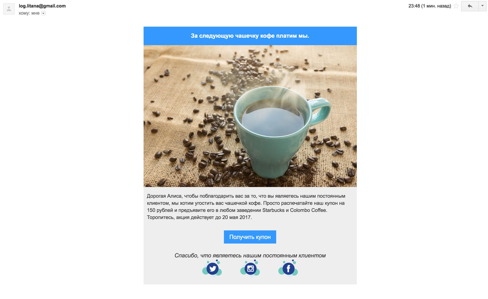

# Send email with ruby

Example, how to send email with gmail account. Written on ruby. Used [mail](https://github.com/mikel/mail) gem.

## Example

## Useful resources

* https://pixabay.com/ - free pictures with Creative Commons CCO license
* https://imgbb.com/ - image hosting
* https://templates.mailchimp.com/resources/inline-css/ - CSS Inliner Tool
* https://www.campaignmonitor.com/css/ - Table of CSS support for the top 10 most popular mobile, web and desktop email clients

## Usage

1. Clone or fork this repo
1. `gem install bundler`
1. `bundle install --without development`
1. `cp config/application.yml.example config/application.yml`
1. Edit `config/application.yml`
1. Edit `emails/test.html`
1. `rake gmail`

## License

Free

## Contribute

1. Fork
1. Change
1. Make Pull Request
